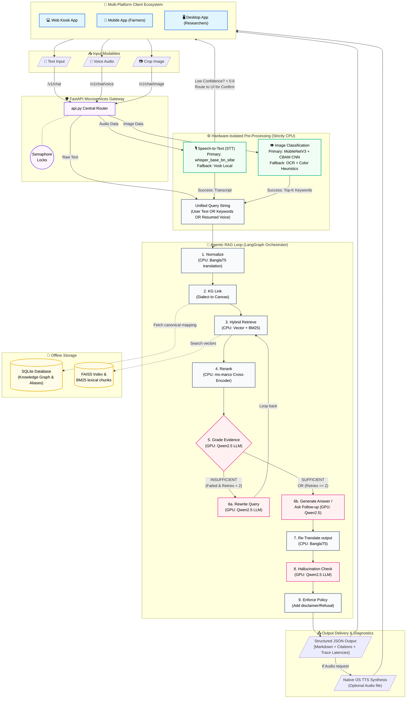

# AgriBot: End-to-End System Workflow & Architecture

This document visualizes the complete data and execution flow of the **AgriBot** system, explicitly showing how inputs from various client platforms are routed through the FastAPI gateway, pre-processed by dedicated CPU models, orchestrated by the Agentic LangGraph loop, and evaluated by the strictly isolated local LLM.

## Workflow Diagram

---

## 🔍 Workflow Breakdown by Phase

### Phase 1: Input & Hardware Distribution
1. **The Client Ecosystem** sends requests to the `FastAPI` Orchestrator. 
2. The orchestrator immediately implements **Concurrency Locks** to ensure the 4GB GPU or limited system RAM does not crash under simultaneous requests.
3. Requests route to **Strictly CPU-bound modules** based on modality:
   - **Images** bypass LLMs entirely and hit a specialized **MobileNetV3 + CBAM CNN** (which outputs textual condition keywords like *"Tomato Early Blight"*).
   - **Voice** audio is transcribed by an offline `faster-whisper` module. **Fallback:** If confidence is below 60%, it aborts the LLM run and queries the user via the UI to confirm what they said.

### Phase 2: The Agentic Core (LangGraph)
Once the input is transformed into standardized text/keywords, it enters the self-correcting RAG workflow:
1. **Normalize & Link:** The query is formatted (translated if needed via `BanglaT5`) and mapped against a local **SQLite Knowledge Graph** to convert regional slang into scientific terminology.
2. **Hybrid Search:** Both semantic (`FAISS/sentence-transformers`) and lexical (`BM25`) searching extracts candidate PDF chunks matching the expanded query.
3. **Reranking:** The CPU-bound Cross-Encoder scores exact matches, trimming noise.
4. **GPU Hand-off (Grading & Rewrite Loop):** The `Qwen2.5` LLM steps in to **Grade** the top chunks. 
   - If the chunks don't contain the answer, the LLM actively **Rewrites** the search query and loops back to the retrieval stage.
5. **Generation & Conversational Fallback:** Once sufficient evidence is found (or maximum search retries are hit), the system generates an answer. If visual context is missing (because the CNN gave keyword hints without full environmental understanding), the LLM skips answering and generates a *Follow-up question* to the farmer (e.g., *"How old is the affected crop?"*).

### Phase 3: Safety & Delivery
1. **Validation:** The final answer is passed *back* through the GPU to check for hallucinations against the raw evidence.
2. **Strict Grounding:** If verification fails, the response is explicitly heavily modified to include disclaimers or full refusals rather than risk giving a farmer fake agricultural advice.
3. **Response:** A highly structured payload featuring exact PDF source-citations and processing latencies is returned to the user, with an optional system TTS audio stream generated for low-literacy users.