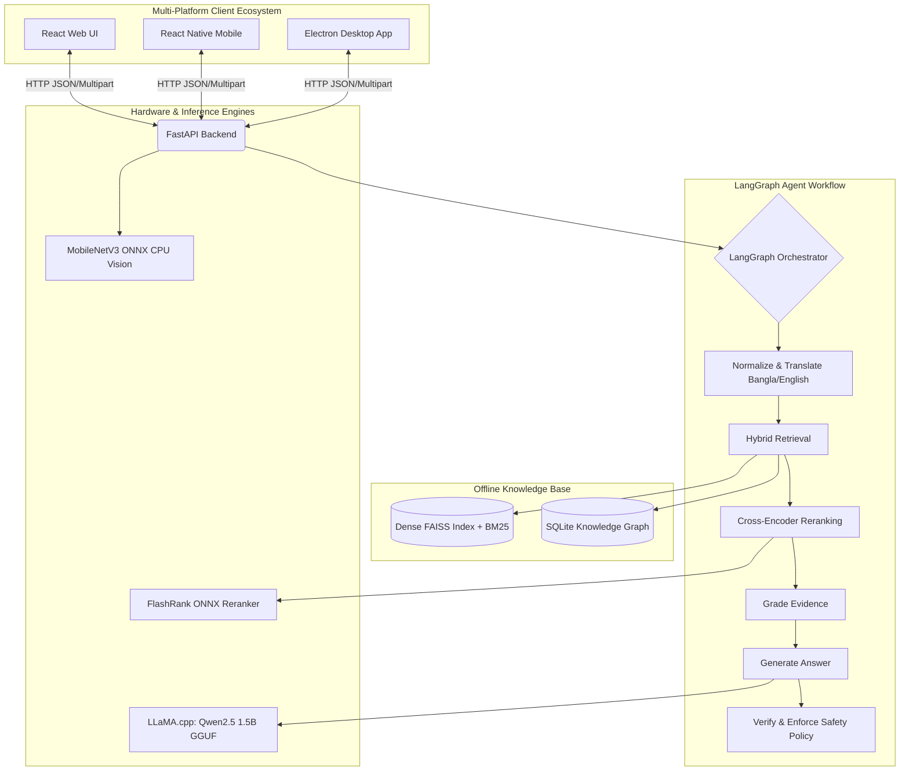

# AgriBot Architecture

## Overview
Overall AgriBot is an advanced Agentic Retrieval-Augmented Generation (RAG) system engineered specifically for agricultural applications. Built from the ground up to operate in purely offline environments, the architecture prioritizes robustness, low-resource inference, and strict domain-safety guardrails.

## Core Subsystems Breakdown

### 1. Agent Orchestrator (`agribot/agent/`)
AgriBot leverages **LangGraph** to model the RAG pipeline as a state machine. This paradigm provides immense flexibility:
- **Conditional Routing**: It can dynamically decide to re-retrieve documents or re-write user queries if the initial evidence grading step fails.
- **Cycles**: Allows iterative refinement without hardcoded loops.
- **State Transparency**: Every node in the graph reads and writes to a shared, immutable `State` object, making debugging highly predictable.

### 2. Multi-modal Ingestion & Processing
To deliver diagnostics to farmers, AgriBot supports Image, Voice, and Text. 
- **Vision Subsystem (`agribot/vision/`)**: Uses a **MobileNetV3 + CBAM** architecture exported to ONNX. Crucially, this runs **strictly on the CPU** to eliminate VRAM out-of-memory bottlenecks on lower-end host machines.
- **Voice Subsystem (`agribot/voice/`)**: Integrated with `BanglaSpeech2Text` and `faster-whisper` for offline ASR (Automatic Speech Recognition) processing of local dialects.

### 3. The Retrieval Layer (`agribot/retrieval/`)
Unlike naive RAG systems, AgriBot utilizes a robust **Hybrid Retriever**:
- **Dense Vector Search**: Powered by `sentence-transformers` and optimized via FAISS for semantic similarity.
- **Sparse Keyword Search**: Leverages `BM25` for strict entity or chemical name matching.
- **Knowledge Graph Integration**: Extracts multi-hop relationships (e.g., *Crop -> Disease -> Pesticide*) from a local SQLite-backed entity store.

After initial hybrid retrieval, a **Cross-Encoder Reranker** filters down the candidate passages to ensure only the highest-fidelity context reaches the LLM.

### 4. Language Generation Engine (`agribot/llm/`)
Because internet access on rural farms is unreliable, the LLM must operate fully locally:
- **Engine**: Powered by `llama-cpp-python` to execute quantized GGUF models rapidly on consumer hardware.
- **Primary Model**: `Qwen2.5-1.5B-Instruct-Q8_0`, which provides robust multilingual capability in a highly compressed memory footprint.
- **Structured Decoding**: Outlines-based constraints are utilized when the model needs to return strictly formatted output (e.g., JSON schemas to the UI).

### 5. Grounding, Hallucination & Safety Policies (`agribot/agent/grounding_policy.py`)
Information reliability in agriculture directly impacts farmer livelihoods.
- **Strict Verification**: Any generated answer is algorithmically verified against the retrieved context to prevent hallucination.
- **Policy Enforcement**: Risk-flagged queries (e.g., heavy pesticide chemical mixtures/dosages) pass through specialized refusal nodes. If the model strays from official agricultural guidelines, it will gracefully fallback to safe default refusals.